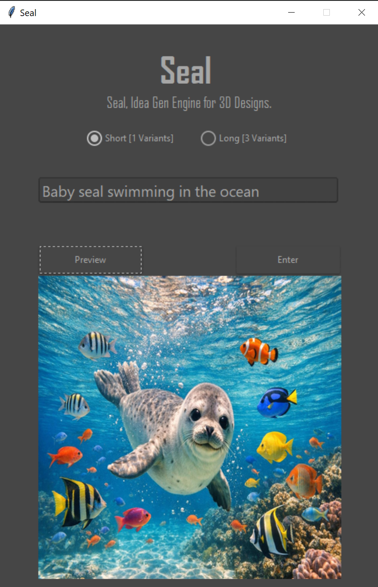

# Seal
# AI Image Generator
for OpenAIs new model gpt-image-1.5

Libraries:
- tkinter
- ttkthemes
- openai
- pillow
- base64 (for image decoding)

Use:
Put your OpenAI Key!
Click Enter to generate.
Click Preview to see your image.
Use Left Arrow Key for Previous image, Use Right Arrow Key for Next image.

Preview Image:

